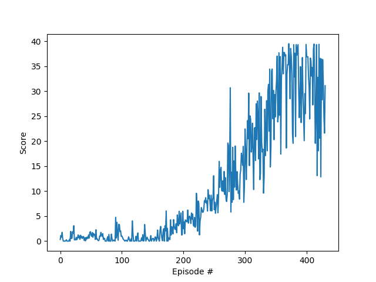

# Project 2 - Continuous Control Using Deep Deterministic Policy Gradients (DDPG) - Implementation Report

## Introduction

In this report we describe the implementation of the reinforcement learning technique known as Deep Deterministic Policy Gradients (DDPG), used to solve a continuous control problem. Please refer to file `README.md` for a complete description of the specific problem/environment. 

Our solution uses a standard Deep Deterministic Policy Gradients (DDPG) implementation as described in the original [research paper](https://arxiv.org/pdf/1509.02971.pdf), to solve the *single-agent* version of the problem, considered to be harder since the amount of experience available is limited in comparison with the environment where twenty agents are simulated simultaneously. 

The implementation is a slightly modified version of the one provided as an exercise in the course; our contribution is restricted to adaptation to the specific problem/environment, hyperparameters fine-tuning, and the addition of a mechanism (epsilon decay) to reduce the impact of Ornstein-Uhlenbeck noise in later training episodes, as suggested in discussions with other students in the course.  

## Reinforcement Learning

In a Reinforcement Learning problem an *agent* observes the *state* _s(t)_ of an *environment* in a given moment of time, and chooses an *action* _a(t)_. Since this is a continuous control problem, the action consists in a vector where each dimension is continuous. When executed the action changes the environment moving it to a new state _s(t+1)_, and the action receives a *reward* _r(t+1)_. The objective of the agent is maximize the reward received after multiple interactions with the environment. In order to achieve this goal the agent must *explore* the environment in  order to find out the best actions given the state, and also to *exploit* the acquired knowledge to collect the rewards. As training progresses, the amount of *exploration* must be reduced, above all in deterministic environments. 

## Deep Deterministic Policy Gradients

A *policy* is a function that gives the probability of choosing an action _a_ when observing a state _s_. The *optimal policy* is the one that maximizes the estimated reward obtained when following the policy. 

In Q-learning the agent tries to find the optimal action-value function Q, which maps a (state,action) pair to the estimated reward obtained when following the optimal policy. If the environment state is discrete, the action-value function Q can be represented as a table.

If the environment state is continuous, we need to approximate the action-value function Q. This can be done using a neural network as a non-linear function approximator, adjusting its weights according to the observed rewards. 

If the actions are continuous, standard Q-Learning cannot be used. DDPG solves this limitation by training two separate networks: the Actor approximates the optimal policy deterministically (i.e. approximating the _argmax(Q(s,a)_. The second, network, estimates the value of each state.  

### Neural Network Architecture 

In our implementation, we use two neural network composed by two 128-node hidden Linear layers. 

The input layer of of both networks has 33 nodes, corresponding to the dimension of the environment state. 

The output of the *Actor* network uses a _tanh_ layer with 4 nodes, to provide values between -1 and 1 for each of dimension of the action vector. 

The *Critic* network uses a Rectified Linear Unit (ReLU) at its output, to estimate the value of each state. 


### Experience Replay and Soft Updates

In order to minimize the correlation between samples we use Experience Replay, as originally proposed in [Human-level control through deep reinforcement learning](https://storage.googleapis.com/deepmind-media/dqn/DQNNaturePaper.pdf): past observations _(s, a, s(t+1), r(t+1))_ are stored in a replay circular buffer, from where random observations are sampled to update the network. 

Another improvement from thei original DDPG paper is the use of soft updates: weight updates are performed in a separate network, which is merged after each step using a weight (tau) that prioritizes the value of the target network. This helps reducing the correlation between the target and current Q values, and is used in both the Actor and Critic networks.

We also use gradient normalization, and a parameter (epsilon decay) to reduce the noise introduced by the Ornstein-Uhlenbeck process as training progresses. Without this change the performance of trained agents was degraded by the noise, because the environment is very deterministic. 

### Hyperparameters

The hyperparameters used in our implementation were the following:

Name                            |    Value
--------------------------------|----------------------
Replay Buffer Size              | 1e5
Minibatch size                  | 256 
Discount Factor (Gamma)         | 1.0 
Tau (for soft update of target parameters) | 1e-3
Learning Rate (Actor)                             | 1e-5
Learning Rate (Critic)                             | 3e-5
Maixmum number of training episodes        | 2000
Maximum number of timesteps per episode    | 1000
Starting value of epsilon for action selection | 1.0
Minimum value of epsilon                   |  0.0
Epsilon decay                              | 1e-6

## Results

DDPG was able to solve the problem in the most difficult case, the single-agent version, by achieving an average score of *+30* over 100 consecutive episodes, in 420 training training episodes. 

```
Episode 10 Score: 0.09, Average Score: 0.46, Max: 1.76, Min: 0.00, Time: 22.52
Episode 20 Score: 0.57, Average Score: 0.41, Max: 1.95, Min: 0.00, Time: 23.15
Episode 30 Score: 1.25, Average Score: 0.62, Max: 3.08, Min: 0.00, Time: 23.76
Episode 40 Score: 0.12, Average Score: 0.64, Max: 3.08, Min: 0.00, Time: 23.92
Episode 50 Score: 1.88, Average Score: 0.69, Max: 3.08, Min: 0.00, Time: 24.19
Episode 60 Score: 0.42, Average Score: 0.77, Max: 3.08, Min: 0.00, Time: 24.37
Episode 70 Score: 1.51, Average Score: 0.78, Max: 3.08, Min: 0.00, Time: 24.25
Episode 80 Score: 1.34, Average Score: 0.73, Max: 3.08, Min: 0.00, Time: 24.23
Episode 90 Score: 0.00, Average Score: 0.68, Max: 3.08, Min: 0.00, Time: 24.39
Episode 100 Score: 0.95, Average Score: 0.83, Max: 4.76, Min: 0.00, Time: 30.58
Episode 110 Score: 0.00, Average Score: 0.82, Max: 4.76, Min: 0.00, Time: 26.86
Episode 120 Score: 0.00, Average Score: 0.86, Max: 4.76, Min: 0.00, Time: 22.69
Episode 130 Score: 0.00, Average Score: 0.79, Max: 4.76, Min: 0.00, Time: 23.17
Episode 140 Score: 0.00, Average Score: 0.79, Max: 4.76, Min: 0.00, Time: 23.08
Episode 150 Score: 0.41, Average Score: 0.74, Max: 4.76, Min: 0.00, Time: 23.49
Episode 160 Score: 0.73, Average Score: 0.68, Max: 4.76, Min: 0.00, Time: 25.14
Episode 170 Score: 0.00, Average Score: 0.72, Max: 4.76, Min: 0.00, Time: 23.59
Episode 180 Score: 4.27, Average Score: 0.88, Max: 6.05, Min: 0.00, Time: 23.49
Episode 190 Score: 1.67, Average Score: 1.11, Max: 6.05, Min: 0.00, Time: 23.79
Episode 200 Score: 5.97, Average Score: 1.28, Max: 6.05, Min: 0.00, Time: 23.40
Episode 210 Score: 4.85, Average Score: 1.64, Max: 6.22, Min: 0.00, Time: 24.66
Episode 220 Score: 2.76, Average Score: 1.98, Max: 6.22, Min: 0.00, Time: 24.94
Episode 230 Score: 6.73, Average Score: 2.49, Max: 9.59, Min: 0.00, Time: 23.41
Episode 240 Score: 6.02, Average Score: 3.13, Max: 9.59, Min: 0.00, Time: 28.19
Episode 250 Score: 13.10, Average Score: 3.96, Max: 13.10, Min: 0.00, Time: 26.34
Episode 260 Score: 10.77, Average Score: 4.76, Max: 15.96, Min: 0.00, Time: 27.30
Episode 270 Score: 8.55, Average Score: 5.79, Max: 15.96, Min: 0.00, Time: 25.54
Episode 280 Score: 7.79, Average Score: 6.99, Max: 30.72, Min: 0.00, Time: 29.65
Episode 290 Score: 9.55, Average Score: 8.05, Max: 30.72, Min: 0.00, Time: 23.81
Episode 300 Score: 11.10, Average Score: 8.99, Max: 30.72, Min: 0.00, Time: 23.29
Episode 310 Score: 24.42, Average Score: 10.71, Max: 30.72, Min: 0.00, Time: 23.52
Episode 320 Score: 20.34, Average Score: 12.25, Max: 30.72, Min: 0.00, Time: 24.84
Episode 330 Score: 18.42, Average Score: 13.80, Max: 30.72, Min: 0.00, Time: 24.09
Episode 340 Score: 22.02, Average Score: 15.27, Max: 31.40, Min: 0.00, Time: 23.66
Episode 350 Score: 24.87, Average Score: 17.06, Max: 34.47, Min: 0.00, Time: 24.04
Episode 360 Score: 32.53, Average Score: 19.18, Max: 37.72, Min: 0.00, Time: 24.23
Episode 370 Score: 35.35, Average Score: 21.47, Max: 38.83, Min: 0.00, Time: 23.56
Episode 380 Score: 39.35, Average Score: 23.36, Max: 39.54, Min: 0.00, Time: 23.91
Episode 390 Score: 29.29, Average Score: 25.35, Max: 39.54, Min: 0.00, Time: 23.51
Episode 400 Score: 39.39, Average Score: 26.96, Max: 39.54, Min: 0.00, Time: 23.31
Episode 410 Score: 34.79, Average Score: 28.24, Max: 39.54, Min: 0.00, Time: 24.01
Episode 420 Score: 18.10, Average Score: 29.13, Max: 39.54, Min: 0.00, Time: 23.88
Episode 430 Score: 21.63, Average Score: 29.92, Max: 39.54, Min: 0.00, Time: 23.83
Episode 431 Score: 31.13, Average Score: 30.13, Max: 39.54, Min: 0.00, Time: 23.90

Environment solved in 331 episodes!     Average Score: 30.13
```



## Ideas for Future Work

Using the multi-agent environment can greatly improve training by using the experiences of multiple agents. It would also be interesting to try different algoritms like Advantage Actor-Critic (A2C), Asynchronouse Advantage Actor-Critic (A3C) to solve the problem and see the differences in their performances.  

Going further: the most time-consuming part of this work was hyperparameter tuning. One idea to improve this is to use techniques for selecting them automatically, for example implementing a *grid search* or using a *genetic algorithm* to find the best set of parameters. 

